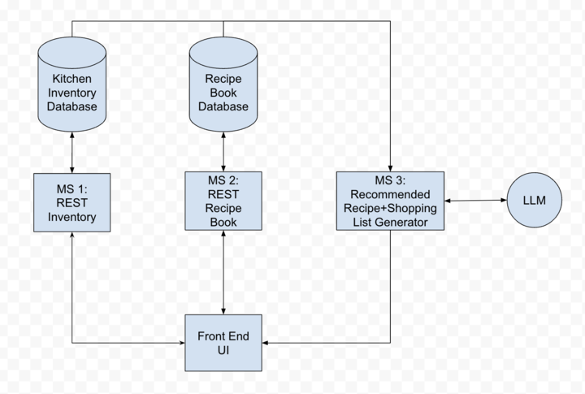

# CPSC-415-01-Project: Personal Recipe Book and Kitchen Inventory Tracker
### * Indicates MVP

This project is a simple Recipe Book and Kitchen Inventory service. Recipes and food items all have CRUD operations available to the user, and other functionality may include shopping list recommendations, and recipe recommendations based on current kitchen inventory. The goal of this project is to help provide a user-friendly centralized place that makes life easier for casual kitchen users.

## Group Members
- George Zack
- Jeff Cui
- Ibsa Tassew Geleta

## Possible Microservices

- [ ] REST food item service, with CRUD operations for the current kitchen stock - George*
- [ ] REST recipe service, with CRUD operations for the recipe book - Ibsa*
- [ ] Shopping list generator, based on current kitchen stock, possibly powered by an LLM
- [ ] Recipe recommender based on current kitchen stock, which pulls recipes from SpoonacularAPI - Jeff*

<<<<<<< HEAD
Database module will store user data on the cloud  

=======
Database module will store user data on the cloud

## Technologies
- Microservices: Spring Boot, JavaScript Express
- Database: MySQL
- HTML/CSS/JavaScript
- LLM: Llama2

>>>>>>> 3ca1ced004cd4dd41f27fdd097ef9d0c1bd0f968
## UI Layout

- Landing page will have centralized buttons to navigate to each microservice.
- Each microservice will have its own page in the UI. Once the home page is exited, the services will appear in a side bar.
- REST pages will have four subpages; one for each operation.
- The search pages will list the contents of the recipe book or kitchen inventory, with searching options displayed above
- Each subpage will have input fields for necessary information the user will have to input, as well as a display for recipes.
- The recommendation pages will have a generate button, as well as a display for the result.

