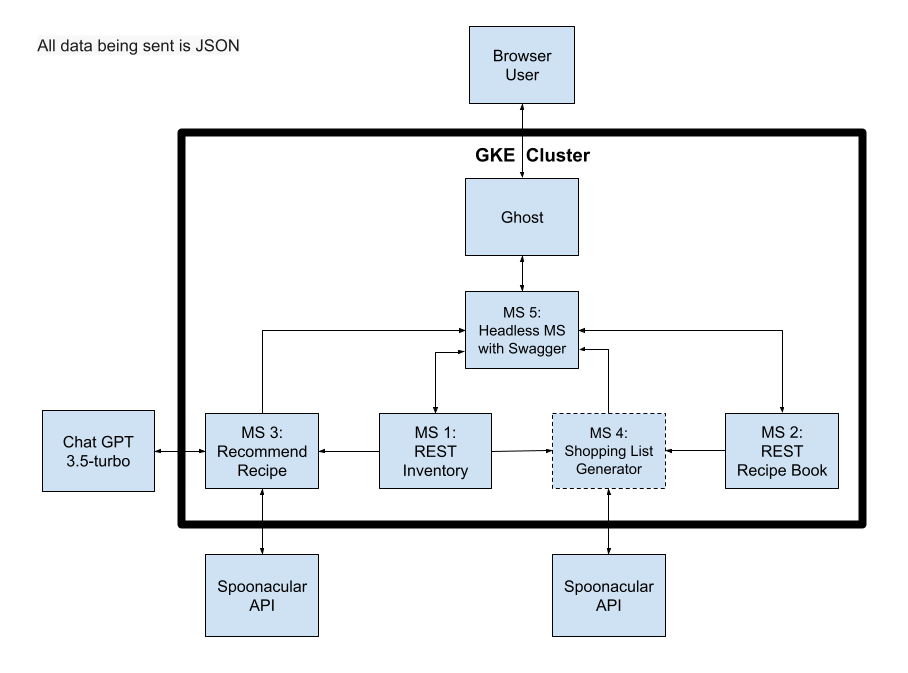

# CPSC-415-01-Project: Personal Recipe Book and Kitchen Inventory Tracker
### * Indicates MVP

This project is a simple Recipe Book and Kitchen Inventory service. Recipes and food items all have CRUD operations available to the user, and other functionality may include shopping list recommendations, and recipe recommendations based on current kitchen inventory. The goal of this project is to help provide a user-friendly centralized place that makes life easier for casual kitchen users.

## Group Members
- George Zack
- Jeff Cui
- Ibsa Tassew Geleta

## Microservices

- [ ] MS 1: REST food item service(George*). 
    - With CRUD operations for the current kitchen stock.
    - **To Run This Microservice In a Docker Container**:
        1. If not done already, clone this repository to a local directory of your choice:
           ```
           git clone https://github.com/Zig-Zag32/CPSC-415-01-Project
           ```
        2. Navigate to this microservice's directory:
           ```
           cd Kitchen-Inventory-Microservice
           ```
        3. Run Gradle build:
           ```
           ./gradlew build
           ```
        4. Build a docker image of this microservice:
           ```
           docker build -t kitchen-inventory-microservice .
           ```
        5. Run this docker image in a container on port 8080:
           ```
           docker run -d -p 8080:8080 kitchen-inventory-microservice
           ```
        6. In a browser, navigate to the visual API:
           ```
           http://localhost:8080/swagger-ui/index.html
           ```

- [ ] MS 2: REST recipe service(Ibsa*).
    - With CRUD operations for the recipe book.  

- [ ] MS 3: Recipe recommender(Jeff*).
    - Capable of invoking the `read` database methods from MS 1 to access ingredients inventory data.
    - Generates Recipe based on ingredients inventory data, powered by LLM llama 2  

- [ ] MS 4: Shopping list generator(Jeff*).
    - Capable of invoking the `read` database methods from MS 2 to find out what ingredients we need for cooking certain recipe.
    - Capable of invoking the `read` database methods from MS 1 to find our what ingredients we already have.
    - Required ingredients - Ingredients in stock = List of missing materials. 
    - Generates a shopping list based on the list of missing materials using [Spoonacular API-Compute Shopping List](https://spoonacular.com/food-api/docs#Compute-Shopping-List)  

- [ ] MS 5: Headless MS  
    - MS 5 contains UI.
    - MS 5 is a headless microservice that integrates functionalities from Microservices 1, 2, 3, and 4, providing a unified set of APIs for the frontend.  


Database module will store user data on the cloud


## Technologies
- Microservices: Spring Boot, JavaScript Express
- Database: MySQL
- HTML/CSS/JavaScript
- LLM: Llama2
- Docker for Containerization
- Kubernetes for Container Orchestration

## UI Layout

- Landing page will have centralized buttons to navigate to each microservice.
- Each microservice will have its own page in the UI. Once the home page is exited, the services will appear in a side bar.
- REST pages will have four subpages; one for each operation.
- The search pages will list the contents of the recipe book or kitchen inventory, with searching options displayed above
- Each subpage will have input fields for necessary information the user will have to input, as well as a display for recipes.
- The recommendation pages will have a generate button, as well as a display for the result.  

## Milestones(34 days left)
1. Week 10: 
2. Week 11: get MVP services working. Not necessarily correctly, but communicating.
3. Week 12:
4. Week 13: 
5. Week 14: 
6. Week 15(only two days): May 7 Course Project Presentations

## Getting stared
```

```
## Docker
```

```
