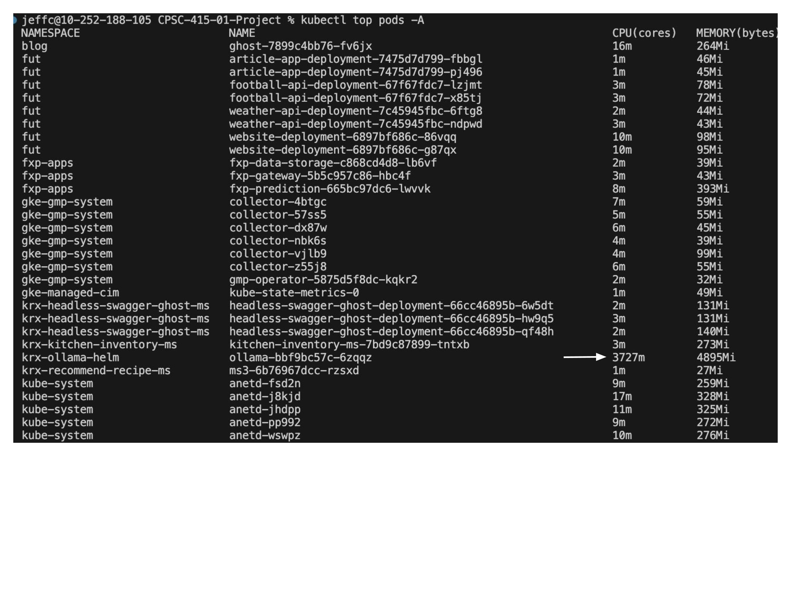

# CPSC-415-01-Project: Personal Recipe Book and Kitchen Inventory Tracker
### * Indicates MVP

This project is a simple Recipe Book and Kitchen Inventory service. Recipes and food items all have CRUD operations available to the user, and other functionality may include shopping list recommendations, and recipe recommendations based on current kitchen inventory. The goal of this project is to help provide a user-friendly centralized place that makes life easier for casual kitchen users.

## Group Members
- George Zack
- Jeff Cui
- Ibsa Tassew Geleta

## Microservices

- [ ] MS 1: REST food item service(George*). 
    - With CRUD operations for the current kitchen stock.

- [ ] MS 2: REST recipe service(Ibsa*).
    - With CRUD operations for the recipe book.  

- [ ] MS 3: Recipe recommender(Jeff*).
    - Calling the `GET` methods from MS 1 to access ingredients inventory data.
    - Generates Recipe based on ingredients inventory data, powered by LLM llama 2 or Chat GPT 3.5-turbo.
    - Generates a random recipe based on the list of missing materials using [Spoonacular API-Get Random Recipes](https://spoonacular.com/food-api/docs#Get-Random-Recipes) 
    - Here is what the Swagger page for MS 3 should look like:
     
    - Here is what the Swagger page for openaiRecipe1 API endpoint should look like:
     

- [ ] MS 4: Shopping list generator(Jeff*).
    - Calling the `GET` methods from MS 2 to find out what ingredients we need for cooking certain recipe.
    - Calling the `GET` methods from MS 1 to find our what ingredients we already have.
    - Required ingredients - Ingredients in stock = List of missing materials. 
    - Generates a shopping list based on the list of missing materials using [Spoonacular API-Compute Shopping List](https://spoonacular.com/food-api/docs#Compute-Shopping-List)  

- [ ] MS 5: Swagger Interface(George*).  
    - MS 5 is a microservice that integrates functionalities from Microservices 1, 2, 3, and 4, providing a unified set of APIs in Swagger UI.  
    - MS 5 is able to call the Ghost API (internal API) to post blogs based on recommended recipes.  

- [ ] Ghost: (Prof.Jonathan*).
    - We are using the Ghost to post blogs based on recommended recipes following those steps:
        - Step 1: APIs of MS 3 are called by MS 5.
        - Step 2: MS 3 gets stored food information from MS1 and sends it to Chat GPT 3.5-turbo with a prompt.
        - Step 3: Chat GPT 3.5 sends back a JSON response(a recipe) to MS 3.
        - Step 3: MS 3 sends back a JSON response to MS 5.
        - Step 4: MS 5 calls Ghost API and sends the JSON response to it.
        - Step 5: Ghost posts a blog based on MS 3's JSON response on http://34.49.160.195/.


Component Diagram:
  

Configuration Diagram:
  

Ollama on the GKE Cluster:


## Dependencies and Technologies

- **Microservices' Source Code**:
  - **Spring Boot**: A framework used for creating Java-based microservices.
  - **Node.js**: A JavaScript runtime used for server-side microservices development.

- **Ghost (Internal API)**:
  - An API used for posting blogs based on recommended recipes.

- **Spoonacular API (External API)**:
  - An API used for obtaining random recipes and computing shopping lists.


- **LLM (Large Language Models)**:
  - **Ollama + Llama2 (Internal API)**: For generating a recipe recommendation.
  - **Chat GPT 3.5-turbo (External API)**: For generating a recipe recommendation.

- **Docker Desktop**:
  - Used for containerization.

- **Kubernetes**:
  - Used for container orchestration.

### Java Dependencies
- **Spring Boot Starter Libraries**:
  - `spring-boot-starter-validation`: Provides validation functionality using Hibernate Validator or other JSR-380 compliant validation frameworks.
  - `spring-boot-starter-web`: For developing Spring MVC and RESTful API web applications.
  - `spring-boot-starter-webflux`: Enables support for building reactive web applications using Spring WebFlux.
- **Other Libraries**:
  - `springdoc-openapi-starter-webmvc-ui`: Generates OpenAPI-compliant API documentation for WebMVC applications.
  - `spring-boot-devtools`: Provides auto-restart and other debugging features during development.
  - `spring-boot-starter-test`: Comprehensive testing support using JUnit, Mockito, and Spring TestContext Framework.

### JavaScript Dependencies
- **axios**: HTTP client library for making API requests.
- **express**: Web framework for Node.js to build web applications.
- **ollama**: Provides an interface to interact with large language models.
- **openai**: Client library for interacting with the OpenAI API.
- **swagger-jsdoc**: Generates API documentation based on JSDoc comments.
- **swagger-ui-express**: Middleware to serve Swagger API documentation in Express applications.


## UI Layout
- Landing page will have centralized buttons to navigate to each microservice.
- Each microservice will have its own page in the UI. Once the home page is exited, the services will appear in a side bar.
- REST pages will have four subpages; one for each operation.
- The search pages will list the contents of the recipe book or kitchen inventory, with searching options displayed above
- Each subpage will have input fields for necessary information the user will have to input, as well as a display for recipes.
- The recommendation pages will have a generate button, as well as a display for the result.  

## Milestones (2 days left)
1. Week 10: Set up component diagram.
2. Week 11: Get MVP services working. Not necessarily correctly, but communicating.
3. Week 12: Get each microservice running and containerize them
4. Week 13: Get everything running correctly on the docker desktop cluster.
5. Week 14: Deploy everything to the GKE cluster. 
6. Week 15(only two days): May 7 Course Project Presentations.  

## Getting started
### User access: 
1. MS 5: http://34.111.130.246/  

2. Ghost: http://34.49.160.195/

### Deploying instructions:   
This project is a microservice-based application designed to be deployed and run on Kubernetes. To deploy it, you'll need either Docker Desktop (with Kubernetes enabled) or a standalone Kubernetes cluster.

To deploy this application on Kubernetes, using this command (ONLY ONE COMMAND!AND IT DEPLOY EVERYTHING! :rocket: ):
```
kubectl apply -f k8s 
```
To delete this application on Kubernetes, using this command:
```
kubectl delete -f k8s 
```

## Citations
1. **ChatGPT-4**: The ChatGPT-4 language model is an advanced generative AI system developed by OpenAI.
2. **Claude 3 Opus**: Claude 3 Opus is an AI model by Anthropic with conversational capabilities.
3. **Sock Shop Demo**: This project references the `sock-shop-demo` repository for microservices demonstration purposes:
   - Repository: [Sock Shop Demo](https://github.com/ocp-power-demos/sock-shop-demo)
4. **LLaMA 2**: For information about the LLaMA 2 model, refer to the Hugging Face blog post:
   - Blog Post: [Introducing LLaMA 2](https://huggingface.co/blog/llama2)
5. **LLaMA 2 Prompt Formatting**: For a guide to formatting prompts for LLaMA 2, check out this Reddit post:
   - Reddit Post: [Get LLaMA 2 Prompt Format Right](https://www.reddit.com/r/LocalLLaMA/comments/155po2p/get_llama_2_prompt_format_right/)
6. **Kubernetes Examples**: This project also draws inspiration from the Kubernetes examples repository:
   - Repository: [Kubernetes Examples](https://github.com/kubernetes/examples)